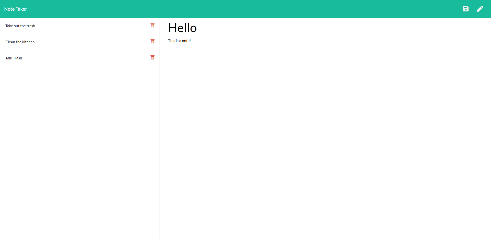

# Note Taker

## Table of Contents:

- [Purpose](#purpose)
- [Features](#features)
- [Usage](#usage)
- [Website](#website)

## Purpose

- This website will allow a user to add, edit, and delete notes

## Usage

- Click the pen to add a new note
- Click the red trash icon to delete a note
- Click a existing note to edit a note
- When finished editing or adding a note, click the save button in upper right corner to save the note

## Features

- Express.js & Express.js Router
- JSON/RESTful API
- Created with HTML, CSS, and JS

## Website

[Deployed Weather App](https://vast-atoll-67249.herokuapp.com/)
